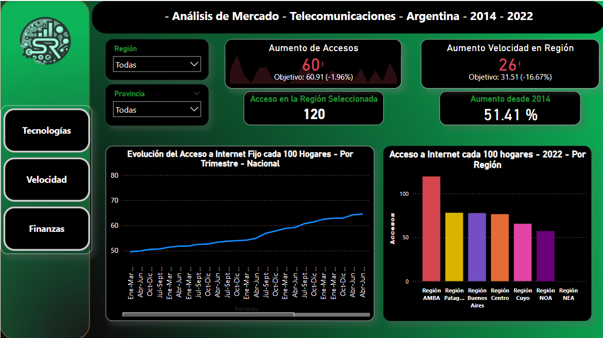
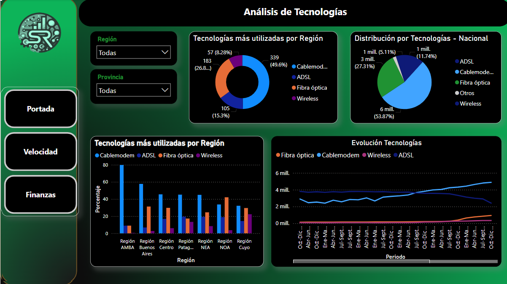
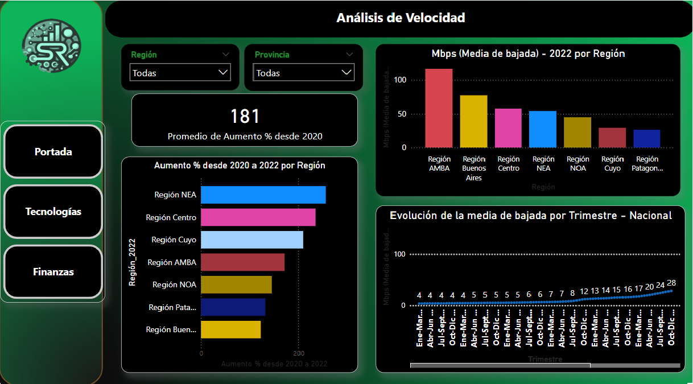

# Data Analytics Project - "Internet-Argentina"

# 📍 Introducción

Este  proyecto aborda  las principales caracteristicas de acceso, infraestructura y calidad de la  conexión  de  internet  fija en  relación  a  las  características  sociodemográficas  de  Argentina  entre  los  años 2014 y 2022.

Para tal efecto, se utiliza como data principal la proporcionada por [ENACOM](https://datosabiertos.enacom.gob.ar/dashboards/20000/acceso-a-internet/).

El análisis abarca diferentes aspectos relacionados a la conectividad a internet a nivel nacional y provincial, así como a la calidad de dicha conectividad, examinando la cantidad de accesos y abarcando las diferentes tecnologías presentes en Argentina, así como los rangos de velocidades, la velocidad media de bajada, el crecimiento porcentual de estas variables y la detección de zonas críticas respecto a éstas.

Se hace especial hincapié en el análisis por regiones.

## 📊 Dashboard

# 📍 Contenido del repositorio

En este repositorio se encuentran almacenadas cuatro carpetas y tres archivos:

* En la carpeta **Data** se encuentran todas las bases de datos utilizadas.
* En el archivo **EDA** se encuentra la documentación y el paso a paso del EDA.
* En el archivo **Dashboard** se encuentra la presentación de Power Bi correspondiente al proyecto, la cual muestra el estado actual de los KPI´s.

## 📙  Diccionario de datos

| Campo                    | Descripción                                                                                                              |
| ------------------------ | ------------------------------------------------------------------------------------------------------------------------- |
| Año                     | El año correspondiente a los datos de la fila.                                                                           |
| Trimestre                | El trimestre correspondiente a los datos de la fila.                                                                      |
| Provincia                | El nombre de la provincia para la cual se proporcionan los datos.                                                         |
| ADSL                     | Número de conexiones de tipo ADSL en la provincia para el año y trimestre específicos.                                 |
| Cablemodem               | Número de conexiones de tipo Cablemodem en la provincia para el año y trimestre específicos.                           |
| Fibra óptica            | Número de conexiones de tipo Fibra óptica en la provincia para el año y trimestre específicos.                        |
| Wireless                 | Número de conexiones de tipo Wireless en la provincia para el año y trimestre específicos.                             |
| Otros                    | Número de conexiones de otros tipos en la provincia para el año y trimestre específicos.                               |
| Total_conexion           | Total de conexiones de Internet en la provincia para el año y trimestre específicos.                                    |
| Accesos por cada 100 hab | Número de accesos a Internet por cada 100 habitantes en la provincia para el año y trimestre específicos.              |
| Accesos por cada 100 hog | Número de accesos a Internet por cada 100 hogares en la provincia para el año y trimestre específicos.                 |
| Región                  | Región geografica y socioeconomica de la Argentina                                                                       |
| Total suma Mbps          | Total de la suma de todas las conexiones de Internet por velocidad en la provincia para el año y trimestre específicos. |

### ✍ Conclusiones Principales:

> - Se observa un fuerte aumento de la conectividad a nivel nacional, con diferencias regionales, pero con todas las provincias del país avanzando hacia un escenario de mayor conectividad, mejor calidad de la conexión y modernización de las conexiones.
> - El Índice de Internet Inclusivo (3i) 2022 , elaborado por The Economist Intelligence Unit (EIU) en colaboración con Meta, posiciona a Argentina como el cuarto país de la región, después de Chile, Brasil y México, con mejor penetración de red en Latinoamérica. El índice mide el ambiente para la inclusión en internet a través de cuatro grandes ejes: la disponibilidad, la asequibilidad, la relevancia y la preparación de la red.
> - Existen fuertes diferencias en cuanto a la velocidad media de bajada entre el centro y el interior del país, pero se observa una mejora más acelerada de la velocidad en los últimos dos años (2021-2022) por parte de las regiones más postergadas.
> - Uno de los aspectos más interesantes de la infraestructura nacional es el desarrollo de La Red Federal de Fibra Óptica (REFEFO), que nació en 2010 como parte del plan “Argentina Conectada”. Cuenta con 32.585 kilómetros de fibra óptica iluminada que conecta a 1.118 localidades y 20.750.904 ciudadanos a lo ancho y largo del país. Se prevé alcanzar los 38.808 kilómetros iluminados y conectar a más de 22 millones de argentinos a la Red en el año 2023.Dicha tecnología es el principal potencial que tiene el sector para seguir  .
> - El porcentaje de ciudadanos que utiliza internet está en línea con los mejores números de la región.
> - Por último, en cuánto a los operadores, el mercado está concentrado en  grandes empresas nacionales y transnacionales, como Telecom, Telefónica y Claro. Se enriquece el analisis con el aspecto financiero (negativo) de Telecom, el operador más importante, pero se recuerda que el país vive una situación macro-financiera compleja que podría estar distorcionando el analisis.

De acuerdo al análisis realizado, el *objetivo general* de este proyecto se orienta a **la expansión y mejora de la cobertura de red  en Argentina**, estando la expansión directamente relacionada al aumento de accesos, y la mejora a la garantía de una buena calidad en los accesos. Por lo tanto, el énfasis está en el *alcance* y la *calidad* de la red.

# 📍 Herramientas utilizadas

* Python
* Pandas
* Matplotlib
* Seaborn
* Power BI

# 📍 Autor

* Sebastián Risi
